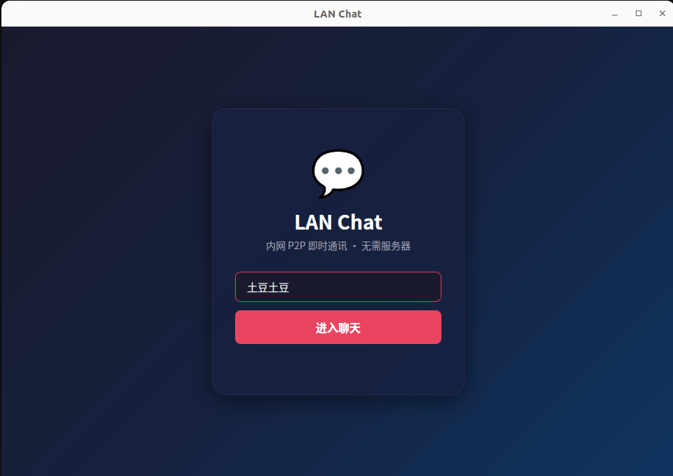
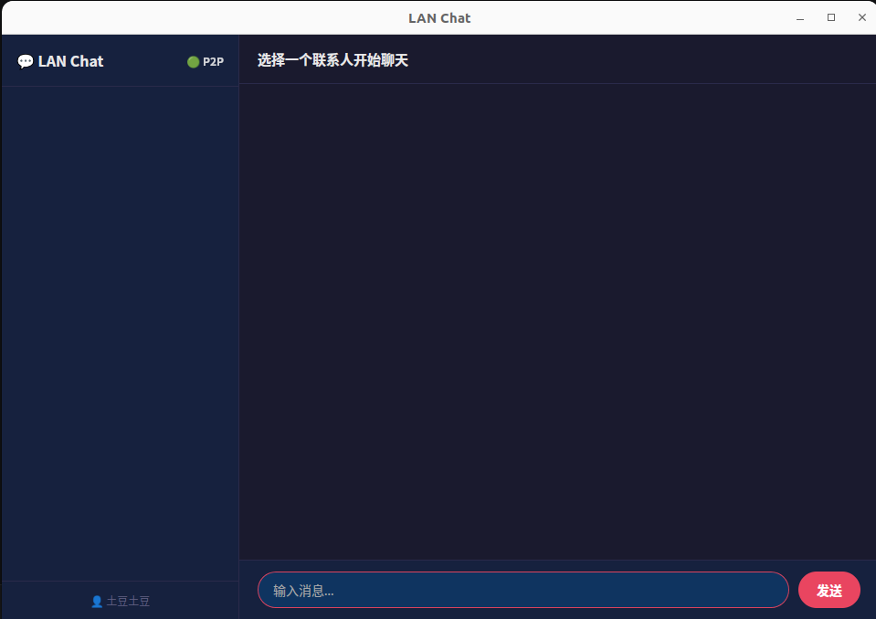
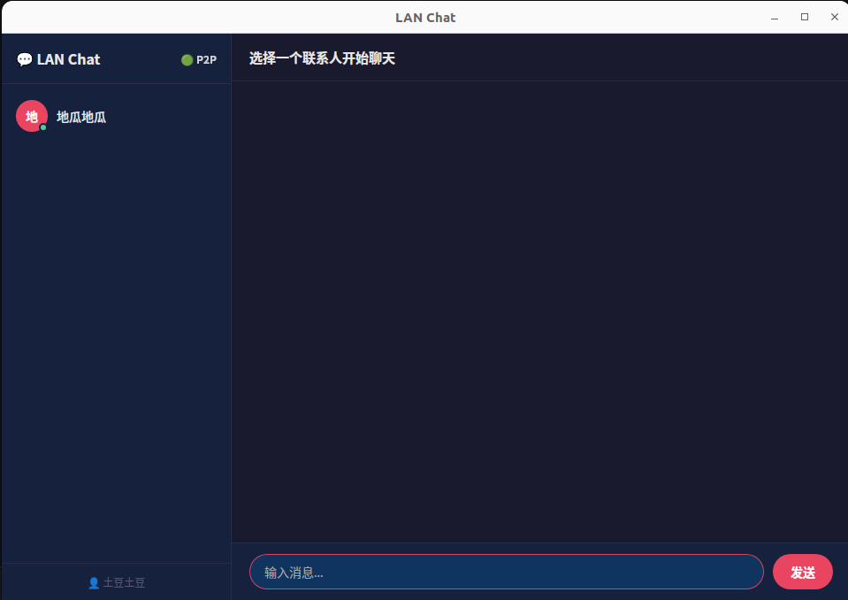
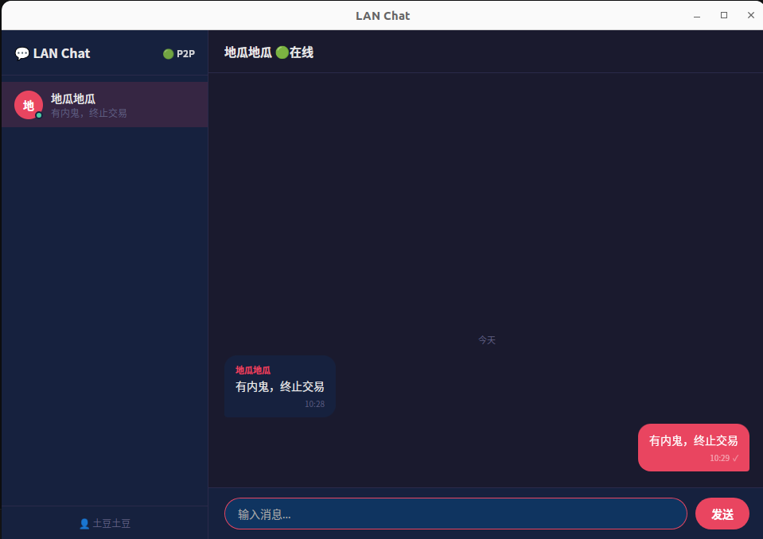

# p2p_chat

### 使用界面
同一局域网用户安装后会自动加载，且只需要输入临时用户名

### 安装系统
只支持linux版本

### 打包命令 
dpkg-deb --build deb/ lan-chat_2.0.0_amd64.deb

### 应用场景
支持内网的实时通信，打开即用，只需要输入此次聊天的用户名即可

### 安装包位置
/dist文件夹内

### 编译命令
  cmake -B build -DCMAKE_BUILD_TYPE=Release
  cmake --build build -j$(nproc)